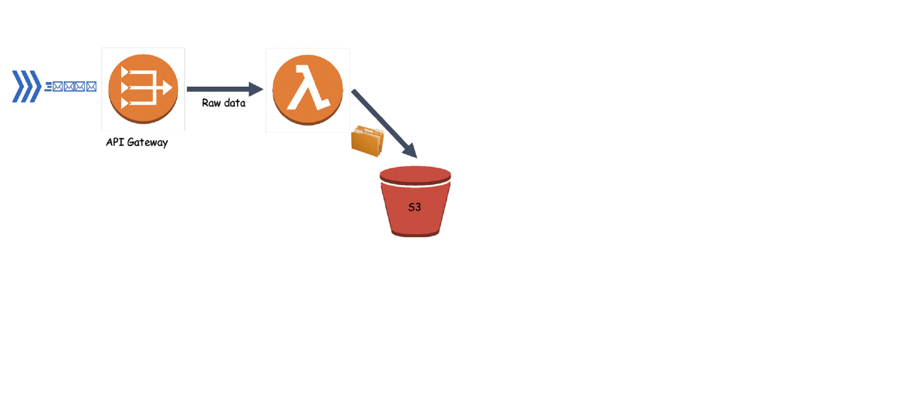
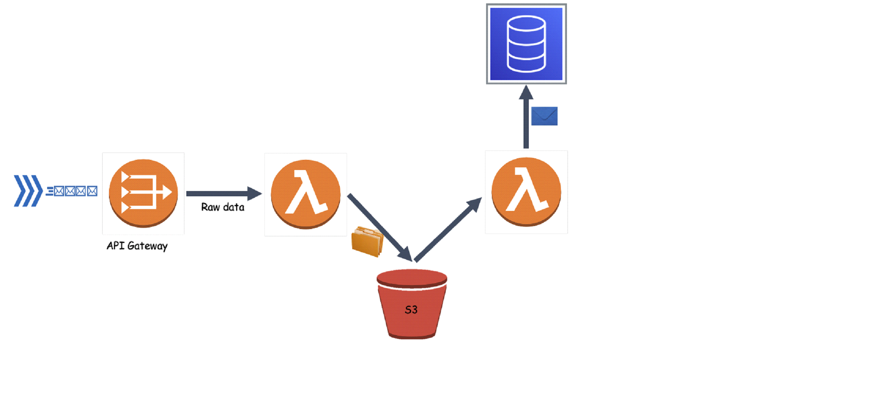
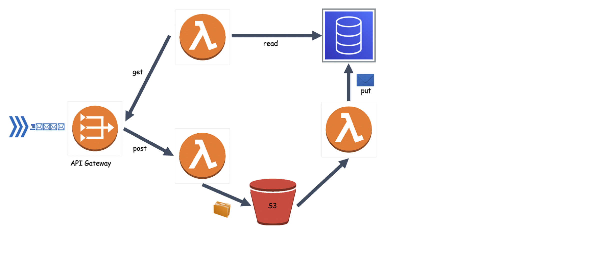

# AWS exercise

You will build an Intrusion detection system (IDS) system to detect anomalies in vehicles using AWS Cloud. In this assignment you will develop ETL (Extract, transform, load) data pipelines to gather data from a vehicle and put them into a single location to query and extract insights.

You will use mock data reports located in the attached file called 'reports.json'.

In the first stage, you will focus on collecting and saving the reports into a Data Lake .
In the second stage, the system will have also the ability to save the reports into DynamoDb.
In the third stage, you will add the ability to read and analyze the already saved reports.

## Phase 1:

- Create REST api-gateway called ‘idsgateway’.

- Create NodeJS lambda called ‘porter’.

- Create POST method on idsgateway and integrate it with ‘porter’ lambda.

- Deploy the api to a new Stage called ‘api’.

- Create an s3 bucket.

- Implement porter lambda to receive events from idsgateway and save the received report into the bucket.

- Iterate over the reports located in the attached ‘reports.json’ file and send them to your api gateway.
  use some HTTP client of your choice. (axios is recommended).

 

## Phase 2:

- Create another NodeJS lambda called ‘ingest’.

- Configure an s3 event notification to invoke the ingest lambda when a new object been inserted into the bucket.

- Create a DynamoDB table called ‘ids-table’. Primary key: ‘vehicleId’.

- Implement Ingest lambda to receive the object path from s3 on object insertion, then read the object and save it to DynamoDB.

 

## Phase 3:

- Create NodeJS lambda called ‘analyzer’.

- Create GET method on ‘idsgateway’, configure the integration point to invoke ‘analyzer’ lambda.

- Implement ‘analyzer’ lambda to support several GET paths.

  - numberOfReports – return the total number of reports stored in DynamoDb.

  - numberOfVehicles – return the number of vehicles record stored in DynamoDb.

  - numberOfAnomalies – return the number of signals that their ‘sum’ value is out of the acceptable range.

- Bonus: create a React app to show the analytics from section 3.
